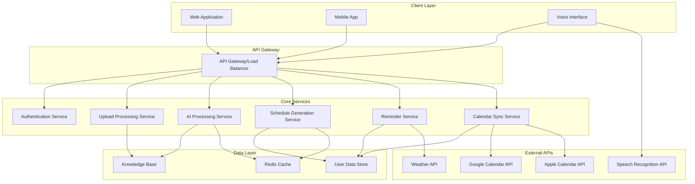

# Design Document: AI Personal Scheduler (Visionary)

## Overview

Visionary is an AI-powered personal scheduling assistant that combines machine learning, natural language processing, and intelligent automation to create personalized schedules based on user goals and preferences. The system learns from uploaded documents, voice inputs, and user feedback to generate flexible daily, weekly, and monthly plans while tracking progress toward financial, health, nutrition, and psychological visions.

The architecture follows a microservices approach with clear separation between data processing, AI reasoning, schedule generation, and user interface components. The system emphasizes privacy-first design with local processing where possible and encrypted cloud storage for synchronization across devices.

## Architecture



## Components and Interfaces

### Upload Processing Service
**Purpose**: Handles document uploads, voice inputs, and text processing
**Key Functions**:
- Document parsing (PDF, TXT, DOCX) using NLP libraries
- Voice-to-text conversion via Google Speech-to-Text API
- Content categorization using machine learning models
- Secure file storage with encryption

**Interface**:
```typescript
interface UploadService {
  processDocument(file: File, userId: string): Promise<ProcessedContent>
  processVoiceInput(audioBlob: Blob, userId: string): Promise<ProcessedContent>
  processTextInput(text: string, userId: string): Promise<ProcessedContent>
}

interface ProcessedContent {
  id: string
  userId: string
  content: string
  category: 'financial' | 'health' | 'nutrition' | 'psychological' | 'task'
  extractedItems: ActionableItem[]
  confidence: number
  timestamp: Date
}
```

### AI Processing Service
**Purpose**: Core intelligence for learning user preferences and generating insights
**Key Functions**:
- Pattern recognition in user behavior
- Goal prioritization based on historical data
- Proactive suggestion generation
- Personalization model training

**Interface**:
```typescript
interface AIService {
  analyzeUserPatterns(userId: string): Promise<UserPatterns>
  generateSuggestions(userId: string, context: ScheduleContext): Promise<Suggestion[]>
  updatePersonalizationModel(userId: string, feedback: UserFeedback): Promise<void>
  categorizeContent(content: string): Promise<ContentCategory>
}

interface UserPatterns {
  preferredTimes: TimePreference[]
  goalPriorities: GoalPriority[]
  activityFrequency: ActivityFrequency[]
  successFactors: SuccessFactor[]
}
```

### Schedule Generation Service
**Purpose**: Creates and manages flexible schedules based on AI insights
**Key Functions**:
- Daily/weekly/monthly schedule generation
- Conflict resolution and optimization
- Alternative suggestion when plans change
- Integration with external calendar events

**Interface**:
```typescript
interface ScheduleService {
  generateSchedule(userId: string, timeframe: TimeFrame, preferences: SchedulePreferences): Promise<Schedule>
  updateSchedule(scheduleId: string, modifications: ScheduleModification[]): Promise<Schedule>
  suggestAlternatives(scheduleId: string, disruption: Disruption): Promise<Alternative[]>
  optimizeSchedule(scheduleId: string): Promise<Schedule>
}

interface Schedule {
  id: string
  userId: string
  timeframe: TimeFrame
  blocks: ScheduleBlock[]
  goalAlignment: GoalAlignment[]
  flexibility: FlexibilityOptions
}
```

### Reminder Service
**Purpose**: Manages notifications and motivational messaging
**Key Functions**:
- Intelligent reminder scheduling
- Multi-channel notification delivery (push, email, SMS)
- Motivational quote integration
- Progress celebration and recovery suggestions

**Interface**:
```typescript
interface ReminderService {
  scheduleReminder(reminder: ReminderRequest): Promise<string>
  sendMotivationalMessage(userId: string, context: MotivationContext): Promise<void>
  celebrateProgress(userId: string, achievement: Achievement): Promise<void>
  suggestRecovery(userId: string, missedGoal: MissedGoal): Promise<RecoverySuggestion[]>
}
```

## Data Models

### User Profile
```typescript
interface UserProfile {
  id: string
  email: string
  preferences: {
    scheduleFormat: 'daily' | 'weekly' | 'monthly'
    reminderChannels: ('push' | 'email' | 'sms')[]
    theme: 'light' | 'dark' | 'auto'
    timezone: string
    language: string
  }
  visions: Vision[]
  createdAt: Date
  updatedAt: Date
}

interface Vision {
  id: string
  category: 'financial' | 'health' | 'nutrition' | 'psychological'
  title: string
  description: string
  targetDate?: Date
  metrics: VisionMetric[]
  priority: number
  status: 'active' | 'paused' | 'completed'
}
```

### Knowledge Base Entry
```typescript
interface KnowledgeEntry {
  id: string
  userId: string
  sourceType: 'document' | 'voice' | 'text' | 'feedback'
  content: string
  extractedData: {
    routines: Routine[]
    goals: Goal[]
    preferences: Preference[]
    constraints: Constraint[]
  }
  category: string
  confidence: number
  createdAt: Date
  lastUsed: Date
}
```

### Schedule Block
```typescript
interface ScheduleBlock {
  id: string
  title: string
  description?: string
  startTime: Date
  endTime: Date
  category: string
  priority: number
  flexibility: {
    timeFlexible: boolean
    durationFlexible: boolean
    locationFlexible: boolean
  }
  relatedVision?: string
  status: 'scheduled' | 'in-progress' | 'completed' | 'skipped'
  alternatives?: Alternative[]
}
```

## Correctness Properties

*A property is a characteristic or behavior that should hold true across all valid executions of a system—essentially, a formal statement about what the system should do. Properties serve as the bridge between human-readable specifications and machine-verifiable correctness guarantees.*

Now I need to analyze the acceptance criteria to determine which ones can be tested as properties:

### Property Reflection

After analyzing all acceptance criteria, I identified several areas where properties can be consolidated to eliminate redundancy:

- **Data Processing Properties**: Multiple criteria about parsing, categorization, and extraction can be combined into comprehensive data processing properties
- **Synchronization Properties**: Cross-platform and real-time update requirements can be unified into synchronization properties  
- **Security Properties**: Various encryption and privacy requirements can be consolidated into comprehensive security properties
- **Recommendation Properties**: Multiple criteria about AI suggestions and improvements can be combined into recommendation quality properties

### Correctness Properties

**Property 1: Content categorization consistency**
*For any* uploaded content (document, voice, or text), the system should correctly categorize it into one of the predefined categories (financial, health, nutrition, psychological, task) with consistent results across input methods
**Validates: Requirements 1.1, 1.2, 1.5**

**Property 2: Real-time knowledge base updates**
*For any* new data added to the system, the knowledge base should update immediately and trigger corresponding schedule adaptations
**Validates: Requirements 1.3, 2.1**

**Property 3: Data encryption and security**
*For any* user data stored in the system, it should be encrypted using industry-standard methods and properly isolated from other users' data
**Validates: Requirements 1.4, 8.1, 8.5**

**Property 4: Learning from feedback**
*For any* user feedback provided on schedule suggestions, the system should incorporate this feedback and demonstrate measurable improvements in future recommendations
**Validates: Requirements 2.2, 2.5**

**Property 5: Pattern recognition and optimization**
*For any* user with sufficient historical data, the system should identify recurring patterns and suggest optimal time slots that align with past preferences
**Validates: Requirements 2.3, 7.1**

**Property 6: Vision integration without disruption**
*For any* new vision added to an existing schedule, the system should integrate it while preserving established routines and maintaining schedule stability
**Validates: Requirements 2.4, 3.1**

**Property 7: Schedule modification flexibility**
*For any* requested schedule modification, the system should successfully apply the changes while maintaining goal alignment and constraint satisfaction
**Validates: Requirements 3.2, 3.5**

**Property 8: Conflict-free calendar integration**
*For any* external calendar events, the system should never create schedules that conflict with existing appointments when calendar integration is enabled
**Validates: Requirements 3.4**

**Property 9: Contextual alternative suggestions**
*For any* disruption or external factor affecting planned activities, the system should suggest alternatives that align with the user's goals and current context
**Validates: Requirements 3.3, 4.5**

**Property 10: Comprehensive reminder delivery**
*For any* scheduled task approaching its designated time, the system should send reminders through the user's preferred channels with appropriate motivational content
**Validates: Requirements 4.1, 4.4**

**Property 11: Progress tracking accuracy**
*For any* completed task related to user visions, the system should immediately update progress indicators with accurate percentage calculations and milestone tracking
**Validates: Requirements 4.2, 5.2, 5.4**

**Property 12: Recovery suggestion generation**
*For any* missed goal or falling behind scenario, the system should generate specific recovery actions and alternative approaches
**Validates: Requirements 4.3, 7.2**

**Property 13: Comprehensive progress visualization**
*For any* active vision category, the dashboard should display appropriate charts and visualizations tracking trends and achievements
**Validates: Requirements 5.1, 5.3**

**Property 14: Periodic report generation**
*For any* review period (weekly/monthly), the system should compile comprehensive progress reports with actionable recommendations based on user behavior analysis
**Validates: Requirements 5.5**

**Property 15: Cross-platform data synchronization**
*For any* data change made on one platform, the same data should be immediately available and consistent across all other platforms (web, mobile)
**Validates: Requirements 6.1, 6.4**

**Property 16: Multi-modal input support**
*For any* input method (drag-and-drop, text, voice), the upload portal should successfully process the input and produce equivalent results
**Validates: Requirements 6.2**

**Property 17: Theme persistence and application**
*For any* theme preference selected by the user, the interface should apply and persist the theme across all sessions and platforms
**Validates: Requirements 6.5**

**Property 18: Actionable recommendation generation**
*For any* improvement opportunity detected by the system, it should generate specific, actionable recommendations based on the user's historical data and current goals
**Validates: Requirements 7.4**

**Property 19: Milestone celebration and progression**
*For any* milestone achievement, the system should provide celebration feedback and suggest appropriate next steps for continued progress
**Validates: Requirements 7.5**

**Property 20: Secure data deletion**
*For any* user data deletion request, the system should completely remove all associated information including temporary files, voice recordings, and cached data
**Validates: Requirements 8.2, 8.3**

**Property 21: Minimal permission external integration**
*For any* external service integration (calendars), the system should use secure authentication and request only the minimum necessary permissions
**Validates: Requirements 8.4**

## Error Handling

### Upload Processing Errors
- **Invalid file formats**: Return descriptive error messages and suggest supported formats
- **Corrupted files**: Attempt recovery and provide fallback options
- **Voice recognition failures**: Offer text input alternative and retry mechanisms
- **Large file handling**: Implement chunked processing with progress indicators

### AI Processing Errors
- **Insufficient data**: Provide guidance on minimum data requirements
- **Categorization uncertainty**: Allow manual categorization with learning feedback
- **Pattern recognition failures**: Fall back to rule-based scheduling with gradual learning
- **Model update failures**: Maintain previous model version as backup

### Schedule Generation Errors
- **Conflicting constraints**: Present conflict resolution options to users
- **Calendar sync failures**: Provide offline mode with manual sync options
- **Optimization timeouts**: Return best-effort schedule with improvement suggestions
- **External API failures**: Implement graceful degradation and retry logic

### Data Synchronization Errors
- **Network connectivity issues**: Implement offline mode with conflict resolution
- **Version conflicts**: Provide merge options and change history
- **Storage quota exceeded**: Implement data archiving and cleanup suggestions
- **Authentication failures**: Provide clear re-authentication flows

## Testing Strategy

### Dual Testing Approach

The testing strategy employs both unit testing and property-based testing to ensure comprehensive coverage:

**Unit Tests** focus on:
- Specific examples demonstrating correct behavior
- Edge cases and error conditions  
- Integration points between components
- API contract validation
- User interface interactions

**Property-Based Tests** focus on:
- Universal properties that hold for all inputs
- Comprehensive input coverage through randomization
- System behavior under various conditions
- Data consistency across operations
- Security and privacy guarantees

### Property-Based Testing Configuration

- **Testing Framework**: Use Hypothesis for Python backend services and fast-check for TypeScript frontend components
- **Test Iterations**: Minimum 100 iterations per property test to ensure thorough coverage
- **Test Tagging**: Each property test must reference its design document property using the format: **Feature: ai-personal-scheduler, Property {number}: {property_text}**
- **Data Generation**: Implement smart generators that create realistic user data, schedules, and interaction patterns
- **Shrinking Strategy**: Configure automatic test case minimization to identify the smallest failing examples

### Testing Categories

**Data Processing Tests**:
- Document parsing accuracy across file formats
- Voice recognition consistency and error handling
- Content categorization precision and recall
- Knowledge base update integrity

**AI Behavior Tests**:
- Pattern recognition accuracy with synthetic data
- Recommendation relevance and diversity
- Learning convergence with feedback loops
- Personalization model stability

**Schedule Generation Tests**:
- Constraint satisfaction in complex scenarios
- Optimization quality under various conditions
- Conflict resolution effectiveness
- Alternative suggestion relevance

**Security and Privacy Tests**:
- Encryption implementation correctness
- Data isolation between users
- Secure deletion verification
- Authentication and authorization flows

**Integration Tests**:
- Cross-platform synchronization reliability
- External API integration robustness
- Real-time update propagation
- Error recovery and graceful degradation

### Performance Testing

- **Load Testing**: Simulate concurrent users with realistic usage patterns
- **Stress Testing**: Test system limits with extreme data volumes and request rates
- **Endurance Testing**: Verify system stability over extended periods
- **Scalability Testing**: Validate horizontal scaling capabilities

The testing strategy ensures that Visionary maintains high reliability, security, and user experience standards while supporting rapid development and deployment cycles.