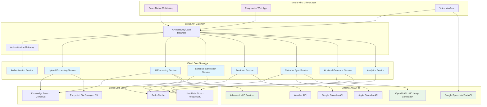

# Design Document: AI Personal Scheduler (Visionary)

## Overview

Visionary is a cloud-based, mobile-first AI-powered personal scheduling assistant that combines advanced machine learning, natural language processing, and intelligent automation to create personalized schedules based on user goals and preferences. The system operates entirely in the cloud to ensure continuous functionality even when user devices are offline, while learning from uploaded documents, voice inputs, and user feedback to generate flexible daily, weekly, and monthly plans with high-definition AI-generated visuals.

The architecture follows a cloud-native microservices approach with mobile-first design principles, featuring autonomous time blocking, focus time protection, multi-calendar integration, and AI-driven insights inspired by leading schedulers like Reclaim AI, Motion, Clockwise, and SkedPal. The system emphasizes premium user experience with AI-generated HD graphics, superior data analytics, and comprehensive testing across mobile and web platforms. All unused components are systematically removed for optimal performance.

## Architecture



## Components and Interfaces

### Upload Processing Service
**Purpose**: Handles document uploads, voice inputs, and text processing with cloud-based processing
**Key Functions**:
- Document parsing (PDF, TXT, DOCX) using advanced NLP libraries
- Voice-to-text conversion via Google Speech-to-Text API with mobile optimization
- Content categorization using machine learning models inspired by Motion and Lindy
- Secure cloud file storage with encryption and offline device independence
- Real-time processing with autonomous rescheduling capabilities

**Interface**:
```typescript
interface UploadService {
  processDocument(file: File, userId: string): Promise<ProcessedContent>
  processVoiceInput(audioBlob: Blob, userId: string): Promise<ProcessedContent>
  processTextInput(text: string, userId: string): Promise<ProcessedContent>
  processMobileUpload(data: MobileUploadData, userId: string): Promise<ProcessedContent>
}

interface ProcessedContent {
  id: string
  userId: string
  content: string
  category: 'financial' | 'health' | 'nutrition' | 'psychological' | 'task'
  extractedItems: ActionableItem[]
  confidence: number
  timestamp: Date
  cloudProcessed: boolean
  mobileOptimized: boolean
}
```

### AI Processing Service
**Purpose**: Core cloud-based intelligence for learning user preferences and generating insights
**Key Functions**:
- Pattern recognition with focus time protection like Reclaim AI
- Goal prioritization with habit defense mechanisms like Motion
- Proactive suggestion generation with autonomous adjustments
- Personalization model training with cloud-based ML
- Advanced analytics with AI-driven insights like Clockwise

**Interface**:
```typescript
interface AIService {
  analyzeUserPatterns(userId: string): Promise<UserPatterns>
  generateSuggestions(userId: string, context: ScheduleContext): Promise<Suggestion[]>
  updatePersonalizationModel(userId: string, feedback: UserFeedback): Promise<void>
  categorizeContent(content: string): Promise<ContentCategory>
  generateAutonomousAdjustments(userId: string, conflicts: Conflict[]): Promise<Adjustment[]>
  protectFocusTime(userId: string, schedule: Schedule): Promise<Schedule>
}

interface UserPatterns {
  preferredTimes: TimePreference[]
  goalPriorities: GoalPriority[]
  activityFrequency: ActivityFrequency[]
  successFactors: SuccessFactor[]
  focusTimePatterns: FocusTimePattern[]
  habitDefenseRules: HabitDefenseRule[]
}
```

### AI Visual Generator Service
**Purpose**: Creates photorealistic, high-definition AI-generated images using external AI models - NO code-generated graphics
**Key Functions**:
- Photorealistic image generation using OpenAI DALL-E, Midjourney, or Stable Diffusion APIs
- Real people in health/fitness scenarios for health progress tracking
- Real nutritious meals and food photography for nutrition goals
- Real office environments and productivity scenarios for work goals
- Real financial success imagery (people with achievements, nice environments)
- Real psychological wellness scenes (peaceful environments, happy people)
- Celebratory images showing real people achieving real milestones
- Premium visual quality that looks like professional photography, not digital graphics

**Interface**:
```typescript
interface AIVisualService {
  generateHealthProgressImage(context: HealthContext): Promise<PhotorealisticImage>
  generateNutritionImage(mealType: string, goals: NutritionGoals): Promise<PhotorealisticImage>
  generateFinancialSuccessImage(achievement: FinancialMilestone): Promise<PhotorealisticImage>
  generateWellnessImage(mood: string, activity: string): Promise<PhotorealisticImage>
  generateCelebrationImage(achievement: Achievement): Promise<PhotorealisticImage>
  generateMotivationalScene(visionCategory: VisionCategory, userContext: UserContext): Promise<PhotorealisticImage>
}

interface PhotorealisticImage {
  id: string
  url: string
  altText: string
  style: 'photorealistic' | 'professional-photography' | 'lifestyle-photography'
  resolution: '4K' | '8K' | 'HD'
  aiModel: 'dall-e-3' | 'midjourney' | 'stable-diffusion'
  prompt: string
  generatedAt: Date
  cacheExpiry: Date
  isRealPhoto: false // AI-generated but photorealistic
  qualityScore: number // 1-10 for realism quality
}
```

### Schedule Generation Service
**Purpose**: Creates and manages flexible schedules with autonomous time blocking
**Key Functions**:
- Daily/weekly/monthly schedule generation with conflict resolution
- Autonomous time blocking inspired by SkedPal and Akiflow
- Multi-calendar integration with conflict prevention
- Dynamic rescheduling with cloud-based processing
- Mobile-first interface optimization

**Interface**:
```typescript
interface ScheduleService {
  generateSchedule(userId: string, timeframe: TimeFrame, preferences: SchedulePreferences): Promise<Schedule>
  updateSchedule(scheduleId: string, modifications: ScheduleModification[]): Promise<Schedule>
  suggestAlternatives(scheduleId: string, disruption: Disruption): Promise<Alternative[]>
  optimizeSchedule(scheduleId: string): Promise<Schedule>
  autonomousTimeBlocking(userId: string, tasks: Task[]): Promise<TimeBlockSchedule>
  integrateMultipleCalendars(userId: string, calendars: ExternalCalendar[]): Promise<IntegratedSchedule>
}

interface Schedule {
  id: string
  userId: string
  timeframe: TimeFrame
  blocks: ScheduleBlock[]
  goalAlignment: GoalAlignment[]
  flexibility: FlexibilityOptions
  autonomousAdjustments: AutonomousAdjustment[]
  focusTimeProtection: FocusTimeBlock[]
}
```

### Reminder Service
**Purpose**: Manages notifications and motivational messaging with conversational tones
**Key Functions**:
- Intelligent reminder scheduling with cloud-based processing
- Multi-channel notification delivery (push, email, SMS) with Toki-inspired conversational tones
- AI-generated motivational images and quotes integration
- Progress celebration with HD visuals and recovery suggestions
- Weather-based alternative suggestions processed via cloud backend

**Interface**:
```typescript
interface ReminderService {
  scheduleReminder(reminder: ReminderRequest): Promise<string>
  sendMotivationalMessage(userId: string, context: MotivationContext): Promise<void>
  celebrateProgress(userId: string, achievement: Achievement): Promise<void>
  suggestRecovery(userId: string, missedGoal: MissedGoal): Promise<RecoverySuggestion[]>
  sendConversationalReminder(userId: string, task: Task, tone: ConversationalTone): Promise<void>
  generateWeatherAlternatives(userId: string, weather: WeatherCondition): Promise<Alternative[]>
}

interface ConversationalTone {
  style: 'supportive' | 'motivational' | 'friendly' | 'professional'
  personality: string
  customization: UserPersonalityPreferences
}
```

### Analytics Service
**Purpose**: Provides superior data analysis with friendly, interactive charts and premium visual analytics
**Key Functions**:
- Advanced progress tracking with AI-driven insights
- Interactive chart generation with AI-enhanced themes
- Premium visual analytics designed for paid user appeal
- Real-time metrics calculation and trend analysis
- Comprehensive reporting with actionable recommendations

**Interface**:
```typescript
interface AnalyticsService {
  generateProgressCharts(userId: string, timeframe: TimeFrame): Promise<InteractiveChart[]>
  calculateAdvancedMetrics(userId: string): Promise<AdvancedMetrics>
  createPremiumVisualReport(userId: string, reportType: ReportType): Promise<PremiumReport>
  analyzeGoalTrends(userId: string, visionId: string): Promise<TrendAnalysis>
  generateActionableInsights(userId: string): Promise<ActionableInsight[]>
}

interface InteractiveChart {
  id: string
  type: 'progress' | 'trend' | 'comparison' | 'forecast'
  data: ChartData
  aiEnhancedTheme: AITheme
  interactivity: InteractivityOptions
  premiumFeatures: PremiumFeature[]
}
```

## Data Models

### User Profile
```typescript
interface UserProfile {
  id: string
  email: string
  preferences: {
    scheduleFormat: 'daily' | 'weekly' | 'monthly'
    reminderChannels: ('push' | 'email' | 'sms')[]
    theme: 'light' | 'dark' | 'auto'
    timezone: string
    language: string
    mobileFirst: boolean
    conversationalTone: ConversationalTone
    visualStyle: VisualStyle
    premiumFeatures: PremiumFeature[]
  }
  visions: Vision[]
  cloudSync: CloudSyncSettings
  aiPersonalization: AIPersonalizationSettings
  createdAt: Date
  updatedAt: Date
}

interface Vision {
  id: string
  category: 'financial' | 'health' | 'nutrition' | 'psychological'
  title: string
  description: string
  targetDate?: Date
  metrics: VisionMetric[]
  priority: number
  status: 'active' | 'paused' | 'completed'
  aiGeneratedVisuals: GeneratedImage[]
  progressVisualization: ProgressVisualization
}

interface CloudSyncSettings {
  enabled: boolean
  offlineMode: boolean
  syncFrequency: 'realtime' | 'hourly' | 'daily'
  conflictResolution: 'cloud-wins' | 'device-wins' | 'manual'
  encryptionLevel: 'standard' | 'enhanced'
}
```

### Knowledge Base Entry
```typescript
interface KnowledgeEntry {
  id: string
  userId: string
  sourceType: 'document' | 'voice' | 'text' | 'feedback' | 'mobile-input'
  content: string
  extractedData: {
    routines: Routine[]
    goals: Goal[]
    preferences: Preference[]
    constraints: Constraint[]
    focusTimeRequirements: FocusTimeRequirement[]
  }
  category: string
  confidence: number
  aiProcessingMetadata: AIProcessingMetadata
  cloudProcessed: boolean
  createdAt: Date
  lastUsed: Date
  encryptionStatus: EncryptionStatus
}

interface AIProcessingMetadata {
  nlpModel: string
  processingTime: number
  confidenceScore: number
  enhancementsApplied: string[]
  inspirationSources: ('reclaim' | 'motion' | 'clockwise' | 'skedpal' | 'lindy' | 'akiflow' | 'structured' | 'toki')[]
}
```

### Schedule Block
```typescript
interface ScheduleBlock {
  id: string
  title: string
  description?: string
  startTime: Date
  endTime: Date
  category: string
  priority: number
  flexibility: {
    timeFlexible: boolean
    durationFlexible: boolean
    locationFlexible: boolean
    autonomousAdjustment: boolean
  }
  relatedVision?: string
  status: 'scheduled' | 'in-progress' | 'completed' | 'skipped' | 'auto-rescheduled'
  alternatives?: Alternative[]
  focusTimeProtection: FocusTimeProtection
  aiEnhancements: AIEnhancement[]
  mobileOptimized: boolean
  visualElements: VisualElement[]
}

interface FocusTimeProtection {
  enabled: boolean
  bufferTime: number
  interruptionHandling: 'block' | 'defer' | 'notify'
  deepWorkMode: boolean
}

interface AIEnhancement {
  type: 'time-optimization' | 'conflict-resolution' | 'habit-defense' | 'focus-protection'
  appliedAt: Date
  confidence: number
  source: string
  impact: ImpactMetrics
}
```

### Premium Visual Analytics
```typescript
interface PremiumVisualAnalytics {
  id: string
  userId: string
  reportType: 'progress' | 'trends' | 'insights' | 'forecasts'
  visualElements: {
    aiGeneratedCharts: AIGeneratedChart[]
    interactiveGraphics: InteractiveGraphic[]
    motivationalImages: GeneratedImage[]
    customThemes: CustomTheme[]
  }
  analyticsData: {
    goalCompletionRates: GoalCompletionRate[]
    productivityTrends: ProductivityTrend[]
    habitStrengths: HabitStrength[]
    improvementOpportunities: ImprovementOpportunity[]
  }
  premiumFeatures: {
    hdQuality: boolean
    aiEnhanced: boolean
    exportOptions: ExportOption[]
    customization: CustomizationLevel
  }
  generatedAt: Date
  cacheExpiry: Date
}
```

## Correctness Properties

*A property is a characteristic or behavior that should hold true across all valid executions of a system—essentially, a formal statement about what the system should do. Properties serve as the bridge between human-readable specifications and machine-verifiable correctness guarantees.*

### Correctness Properties

**Property 1: Content processing consistency**
*For any* uploaded content (document, voice, or text), the system should correctly parse, categorize, and extract actionable items with consistent results across all input methods, maintaining cloud-based processing and encryption
**Validates: Requirements 1.1, 1.2, 1.5, 2.1**

**Property 2: Real-time knowledge base synchronization**
*For any* new data added to the system, the knowledge base should update immediately in the cloud and trigger corresponding schedule adaptations and progress indicator updates
**Validates: Requirements 1.3, 5.4**

**Property 3: Comprehensive data security**
*For any* user data in the system, it should be encrypted using industry-standard methods, properly isolated from other users, securely deleted upon request, and processed with minimal external permissions
**Validates: Requirements 1.4, 8.1, 8.2, 8.3, 8.4, 8.5**

**Property 4: Adaptive learning and improvement**
*For any* user feedback, missed activities, or historical patterns, the system should incorporate this information to improve future recommendations, adjust scheduling algorithms, and suggest meaningful modifications
**Validates: Requirements 2.2, 2.5, 7.1, 7.2**

**Property 5: Pattern recognition and optimization**
*For any* user with sufficient historical data, the system should identify recurring patterns, suggest optimal time slots with focus time protection, and defend important habits against conflicts
**Validates: Requirements 2.3, 2.4**

**Property 6: Intelligent schedule generation**
*For any* schedule generation request, the system should prioritize tasks from user visions, resolve conflicts autonomously, allow flexible modifications, and integrate with external calendars without conflicts
**Validates: Requirements 3.1, 3.2, 3.4**

**Property 7: Contextual alternative suggestions**
*For any* disruption, weather condition, or external factor affecting planned activities, the system should suggest appropriate alternatives that align with user goals and current context
**Validates: Requirements 3.3, 4.5**

**Property 8: Adaptive schedule formatting**
*For any* user preference for schedule format, the system should adapt to display appropriate views (daily, weekly, monthly) with high-definition visual timelines and support multiple input methods
**Validates: Requirements 3.5, 6.2**

**Property 9: Comprehensive reminder delivery**
*For any* scheduled task approaching its designated time, the system should send reminders through preferred channels with conversational tones and include motivational content tied to user visions
**Validates: Requirements 4.1, 4.4**

**Property 10: Progress tracking and celebration**
*For any* progress toward visions or milestone achievement, the system should provide accurate updates, calculate correct metrics, and generate appropriate celebrations with AI-generated HD images
**Validates: Requirements 4.2, 5.2, 7.5**

**Property 11: Recovery suggestion generation**
*For any* missed goal or falling behind scenario, the system should generate specific recovery actions and alternative approaches based on user data and analytics
**Validates: Requirements 4.3, 7.4**

**Property 12: Premium visual analytics generation**
*For any* progress display, behavior analysis, or visual generation request, the system should create high-definition charts, AI-generated images, and interactive graphics using external AI models (not code-generated)
**Validates: Requirements 5.1, 5.3, 9.3**

**Property 13: Comprehensive reporting**
*For any* review period (weekly/monthly), the system should compile progress reports with actionable recommendations and premium visual analytics designed for paid user appeal
**Validates: Requirements 5.5**

**Property 14: Cross-platform synchronization**
*For any* data change made on one platform, the same data should be immediately available and consistent across all other platforms, with cloud backend ensuring continuous operation even when devices are offline
**Validates: Requirements 6.4, 9.2**

**Property 15: Theme persistence and application**
*For any* theme preference selected by the user, the interface should apply and persist the theme across all sessions and platforms with premium visual features
**Validates: Requirements 6.5**

## Error Handling

### Upload Processing Errors
- **Invalid file formats**: Return descriptive error messages and suggest supported formats
- **Corrupted files**: Attempt recovery and provide fallback options
- **Voice recognition failures**: Offer text input alternative and retry mechanisms
- **Large file handling**: Implement chunked processing with progress indicators

### AI Processing Errors
- **Insufficient data**: Provide guidance on minimum data requirements
- **Categorization uncertainty**: Allow manual categorization with learning feedback
- **Pattern recognition failures**: Fall back to rule-based scheduling with gradual learning
- **Model update failures**: Maintain previous model version as backup

### Schedule Generation Errors
- **Conflicting constraints**: Present conflict resolution options to users
- **Calendar sync failures**: Provide offline mode with manual sync options
- **Optimization timeouts**: Return best-effort schedule with improvement suggestions
- **External API failures**: Implement graceful degradation and retry logic

### Data Synchronization Errors
- **Network connectivity issues**: Implement offline mode with conflict resolution
- **Version conflicts**: Provide merge options and change history
- **Storage quota exceeded**: Implement data archiving and cleanup suggestions
- **Authentication failures**: Provide clear re-authentication flows

## Testing Strategy

### Dual Testing Approach

The testing strategy employs both unit testing and property-based testing to ensure comprehensive coverage across mobile and web platforms:

**Unit Tests** focus on:
- Specific examples demonstrating correct behavior
- Edge cases and error conditions for mobile and cloud scenarios
- Integration points between cloud services and mobile clients
- API contract validation for cloud-based processing
- Mobile-first user interface interactions and touch-friendly designs
- AI-generated visual content validation

**Property-Based Tests** focus on:
- Universal properties that hold for all inputs across platforms
- Comprehensive input coverage through randomization with mobile-specific scenarios
- System behavior under various cloud and offline conditions
- Data consistency across cloud synchronization operations
- Security and privacy guarantees for cloud-stored encrypted data
- Premium visual analytics quality and AI-generated content verification

### Property-Based Testing Configuration

- **Testing Framework**: Use Hypothesis for Python cloud backend services and fast-check for TypeScript/React Native mobile components
- **Test Iterations**: Minimum 100 iterations per property test to ensure thorough coverage across mobile and web scenarios
- **Test Tagging**: Each property test must reference its design document property using the format: **Feature: ai-personal-scheduler, Property {number}: {property_text}**
- **Data Generation**: Implement smart generators that create realistic user data, mobile interaction patterns, cloud sync scenarios, and AI-generated content
- **Shrinking Strategy**: Configure automatic test case minimization to identify the smallest failing examples
- **Cloud Testing**: Include cloud backend independence testing to verify offline device scenarios
- **Mobile Testing**: Specialized generators for touch interactions, mobile upload scenarios, and cross-platform synchronization

### Testing Categories

**Cloud-Based Data Processing Tests**:
- Document parsing accuracy across file formats with cloud processing
- Voice recognition consistency and error handling via cloud APIs
- Content categorization precision using advanced NLP models
- Knowledge base update integrity with real-time cloud synchronization
- Encryption verification for all cloud-stored data

**AI Behavior and Visual Generation Tests**:
- Pattern recognition accuracy with synthetic mobile usage data
- Recommendation relevance inspired by top AI schedulers (Reclaim, Motion, Clockwise)
- Learning convergence with feedback loops from mobile interactions
- AI-generated HD visual quality verification (not code-generated)
- Premium visual analytics validation for paid user appeal

**Mobile-First Schedule Generation Tests**:
- Constraint satisfaction in complex mobile scenarios
- Autonomous time blocking optimization under various conditions
- Multi-calendar conflict resolution effectiveness with Akiflow-inspired features
- Focus time protection validation similar to Reclaim AI
- Alternative suggestion relevance for mobile context switching

**Security and Privacy Tests**:
- Industry-standard encryption implementation correctness for cloud storage
- Data isolation between users in cloud environment
- Secure deletion verification including unused files and folders
- Authentication and authorization flows for mobile and web
- Minimal permission validation for external calendar integrations

**Cross-Platform Integration Tests**:
- Mobile-to-cloud synchronization reliability with offline scenarios
- External AI API integration robustness (OpenAI, Google Speech-to-Text)
- Real-time update propagation between mobile and web clients
- Error recovery and graceful degradation in cloud services
- Premium feature availability across platforms

**Premium Visual Analytics Tests**:
- HD chart generation quality using AI-enhanced themes
- Interactive graphics performance on mobile devices
- AI-generated motivational image appropriateness and quality
- Custom visualization rendering across different screen sizes
- Export functionality for premium visual reports

### Performance and Optimization Testing

- **Load Testing**: Simulate concurrent mobile users with realistic cloud backend usage patterns
- **Stress Testing**: Test cloud system limits with extreme data volumes and mobile request bursts
- **Endurance Testing**: Verify cloud backend stability over extended periods with offline devices
- **Scalability Testing**: Validate horizontal scaling capabilities for cloud services
- **Mobile Performance**: Test mobile app responsiveness with cloud backend processing
- **Optimization Verification**: Ensure unused components are deleted and performance is optimized

### Comprehensive Platform Testing

**Mobile Testing Requirements**:
- React Native app functionality across iOS and Android
- Touch-friendly interface validation
- Mobile upload portal testing (drag-drop, voice, text)
- Offline mode functionality with cloud sync recovery
- Push notification delivery and interaction

**Web Testing Requirements**:
- Progressive Web App functionality
- Cross-browser compatibility
- Desktop and tablet responsive design
- Web-based upload portal testing
- Real-time synchronization with mobile clients

**Cloud Backend Testing Requirements**:
- Continuous operation verification when all user devices are offline
- Auto-scaling under varying load conditions
- Data consistency across distributed cloud services
- Disaster recovery and backup validation
- API rate limiting and security testing

The testing strategy ensures that Visionary maintains premium quality standards, comprehensive security, and exceptional user experience across all platforms while supporting the advanced AI features and cloud-based architecture that users would pay for.